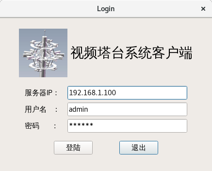
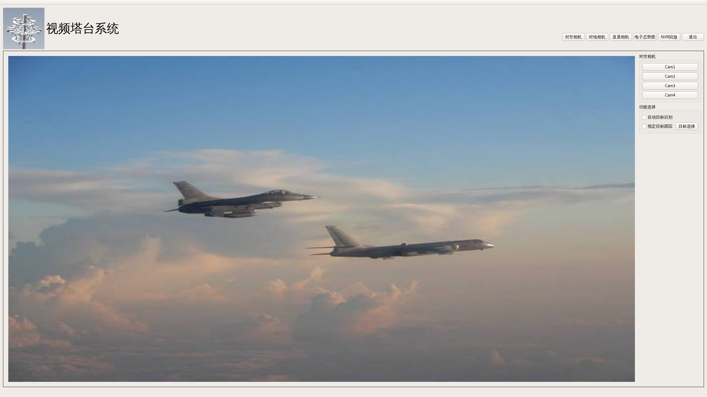
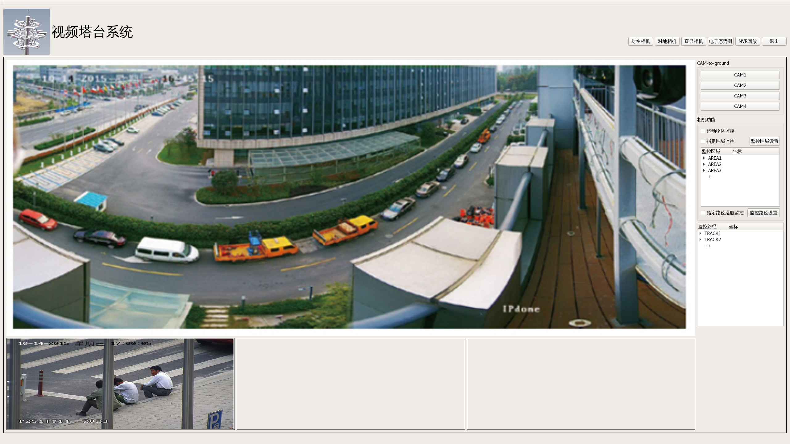
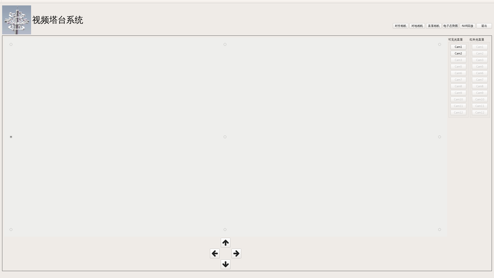
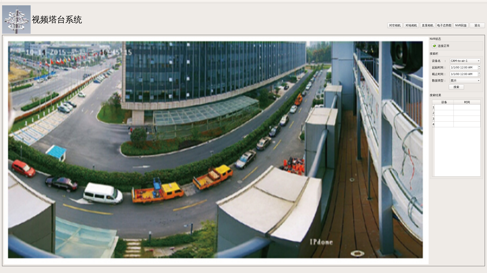

## 客户端界面设计
- 登陆界面
- 主界面
  - 菜单栏
  - 对空相机显示
  - 对地相机显示
  - 直显相机配置
  - NVR数据查找与显示
  - 电子态势图

### 1 登陆界面

- logo显示
- ServerIP
- username
- password
- 连接
- 退出

### 2 标题栏

- logo
- 系统名称
- 切换到对空相机
- 切换到对地相机
- 切换到直显相机配置
- 切换到电子态势图
- 切换到NVR数据查询
- 系统配置按钮  #先不显示
- 退出按钮

### 3 对空相机显示

- 相机控制栏
  - 相机状态栏：显示4台相机的连接状态
  - 相机切换按钮（未分配相机不能选中，当前显示相机处于激活状态）
  - 相机功能选择
    - 自动跟踪功能 选择框
    - 手动目标跟踪 选择框
      - 目标选择 选中后鼠标指针特化成十字，可以在界面上标记出目标物；取消选中后，清除标记的目标物
- 相机显示界面 ：显示视频流（假定传过来的视频流中已经标记了目标物）

### 4 对地相机显示

- 相机控制栏
  - 相机状态栏：显示4台相机的连接状态
  - 相机切换按钮（未分配相机不能选中，当前显示相机处于激活状态）
  - 相机功能选择
    - 自动动物检测功能 选择框
    - 手动目标跟踪 （内置于相机显示界面）
    - 设置入侵区域设置
    - 启动监控设置的入侵区域
    - 巡航扫描监控路径设置
    - 巡航扫描监控功能启动

- 设置入侵区域设置
  - 添加 通过点击表的最后一项进行天件
  - 修改 右键区域条目或者右键某一点进行修改
  - 删除 右键区域条目或者右键某一点进行删除

- 相机显示界面
  - 主图显示
    - 显示相机的视频流（假设相机视频流中已经对检出的目标物进行标记）
    - 主界面画框时，左向画框和右向画框，分别在局部图片显示区显示不同的图片（缩小局部图，放大局部图）
  - 局部图片显示：同时横向显示三张
    - 显示相机细节通道抓牌的图片

### 5 直显相机配置

- 示意图区域
  - 一张示意图片，包含几个可以选中的点。
  - 点移动控制栏。控制点向外侧移动，会使图片显示区域扩大，向内移动则会使显示区域缩小
    - 上/下/左/右 移动按钮
- 相机切换界面
  - 两排12*按钮（1～12，13~24分别是可见光和红外光），按钮颜色标识相机的连接状态

### 6 电子态势图

- 控制栏
  - 初始化栏
    - 设置俯视图（要求输入图片的大小，方向和比例尺）
    - 生成电子态势图
  - 实时控制  #均是实时生效
    - 清空按钮：清空所有目标轨迹
    - 设置监控数量上限，若目标超出上限则会被自动移除
    - 切换专注模式/全显示
  - 轨迹表：列举所有目标，不能超出数量上限
    - 目标项
      - ignore    #重要程度，ignore的目标在专注模式不会显示
      - focus     #该属性的条目会在电子态势图上突出显示
      - valid     #该属性的条目不会被主动移除
      - 删除       #点击删除后，该项被移除，轨迹也被移除

- 显示界面
  - 俯视图/监控范围/检出目标轨迹各图层叠合的结果

### 7 NVR界面

- 控制栏
  - NVR状态：连接/未连接/报警信息
  - 搜索栏
    - 设备名选项 ：列出每个设备及全部选项（需要在用户权限内；且在NVR上配置过的）
    - 时间段选项：自选
    - 媒体文件类型选择
    - 搜索按钮
  - 搜索结果栏
    - 每一项表示媒体：点击后显示在显示界面上
      - 显示简要信息：设备名/录制时间/
- 显示界面  
  - 显示单个图片或视频：点击项目栏后显示