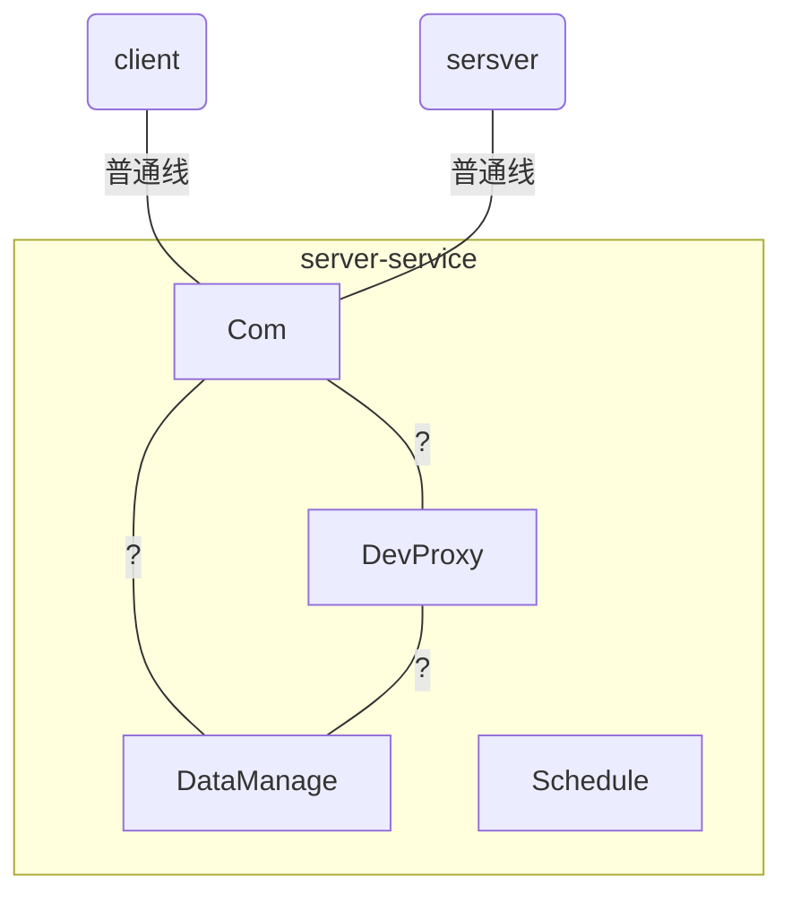

# server_service_design

## 1 功能

- 存取数据
- 响应client与server的http请求
- 与直显相机建立连接，进行交互
- 与client与server建立ws连接，推送报警信息；建立连接表
- 开机启动或者关闭开机启动的脚本

## 2 流程分析与模块设计

### 2.1 流程分析

```mermaid

```

```
- 启动程序，开启监听  #可以是开机自动启动或者通过server界面进行启动
  - 导入本地数据库
  - 轮询设备的连接状态

//branch_server
- server_gui尝试登陆server_service，建立ws连接
  - 若server_service已启动（http验证），直接发送http消息
  - 若server_service未启动（http），让用户选择本次启动/开机启动/退出
- server_service验证权限，建立ws连接
- server_gui建立子线程处理来自ws的消息
- server_gui请求各种数据，server_service处理并返回数据
- server_gui请求修改server_service的数据，server_service修改数据并返回结果
- server_gui点击退出server_service,server_service服务关闭

//branch_client同上

//server_service主动发送的信号
- server_service退出，ws连接自动断开
- server_service信息改变，要求client断开连接


```


### 2.2 模块设计

> 模块层次：

- 静态数据管理
  - 数据获取
  - 数据保存
  - 数据修改
- 设备控制代理
- http通讯模块
- ws连接管理
  - 用户名与ws连接对应的表
- 轮询定时器
  - 定时测试设备连接状态
  - 定时输出log
  - 定时保存运行状态
- 控制器
  - 将几个独立的模块以信号和槽的方式联系起来

- 任务调度模块
  - 将server/client请求的任务保存到该模块
  - 该模块为任务分配线程和资源
  - 向目的地返回处理结果

## 3 详细设计




### 3.1 DataManage
- 保存静态数据
### 3.2 DevProxy
- 用于管理设备
  - 利用缓存的数据初始化若干设备
  - 分组保存设备的信息
  - 定期确认设备的连接状态，设备状态改变时发出信号
  - 与某一设备进行交互<>
  - 添加/删除工作的设备

### 3.3 Com/API
-
#### 3.3.1 功能
- 管理与server与client的交互
- 自动完成信息传输过程的加解密
- 由缓存数据将com进行初始化
- API层是对com层进行封装，添加具体行为(API结构)

#### 3.3.2 运行逻辑
>已有交互的模块，只需要关心API层就行了

```

- 模块初始化
  - 监听http/ws端口

//http
- 接收server与client发送的信息后
  - 保持连接
  - 调用保存的回调函数或者发送信号进行处理
  - 向连接发送时响应数据

- 主动向client/server发送数据
  - 同


```


### 3.4 Schedule


## 4 过程设计

- 建立项目结构
-

## faq
- 对于登陆的账户，每个帐号只能建立一个连接（这样做的话admin不能同时登陆server与client，不能同时操作）
   - 对于每个admin用户创建时，创建一个从属用户，专门用于server登陆

- 对于server与client是否需要将功能编写到同一类中
