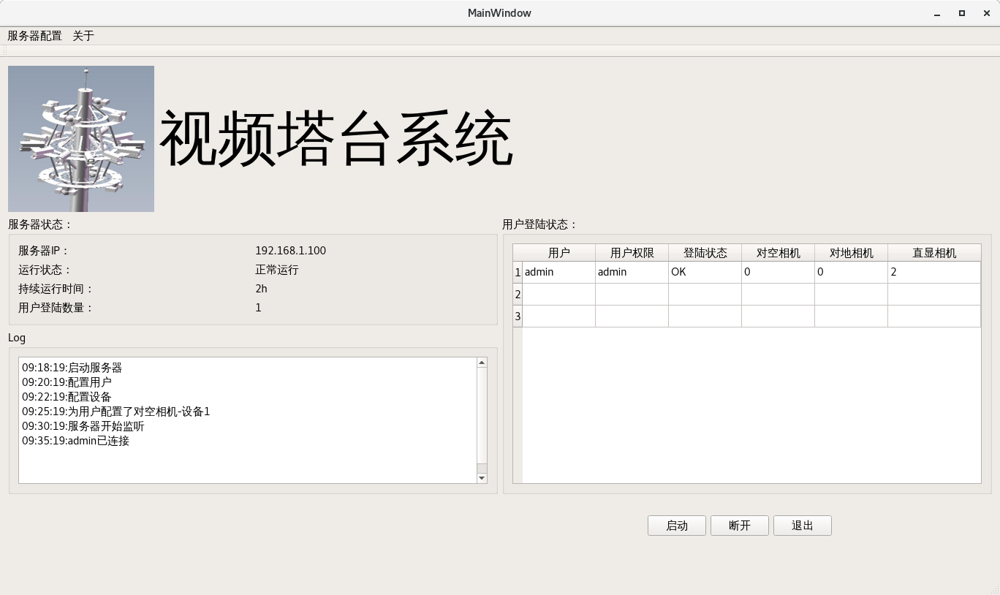
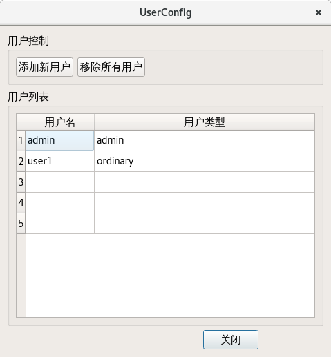
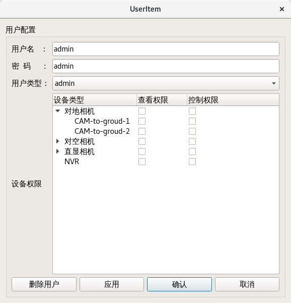
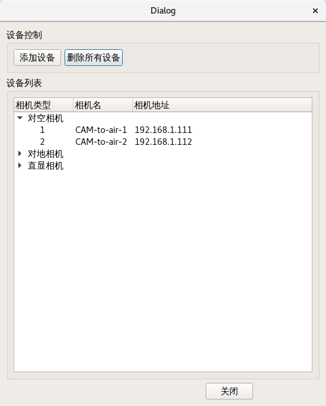
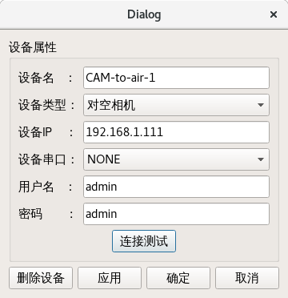
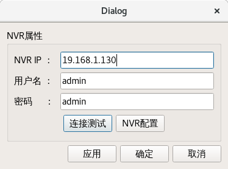

# Server_gui

[toc]

### 1 启动界面

- 服务器IP
- 用户名   #admin用户
- 密码
- 是否开机启动
- 启动
- 取消

### 2 主界面

- 菜单栏
  - 用户管理[切换到用户管理界面]
  - 设备管理[切换到设备管理界面]
  - NVR配置[切换到NVR配置界面]
  - about:显示软件的信息
- 标题栏：显示软件系统名称；logo
- 实时信息界面
  - 显示服务器状态信息：启动时间;运行时间；用户登陆数量
  
  - log信息：关键信息的变化，如服务器启动，用户配置，设备配置，客户端登陆与退出的时间点
  
  - 客户端登陆状态：显示所有的用户，并显示登陆状态和配置的各个设备的数量
  
- 控制栏：
  - 启动按钮
  - 断开按钮
  - 退出按钮

### 3 用户管理界面

- 用户列表：点击条目出现用户编辑界面

- 添加新用户按钮：点击后出现用户编辑界面

- 用户编辑界面
  
  
  
  - 用户名栏（该项只有单击添加新用户才会允许编辑）
  - 用户密码
  - 设置设备
    - 采用树状表方式+单选框实现对设备的添加和配置
  - 删除用户按钮
  - 应用按钮
  - 确定按钮
  - 取消按钮
  
- 关闭按钮

### 4 设备管理界面

- 设备列表：三种类型的设备分别显示；双击某条目出现设备编辑界面

- 添加新设备按钮：点击后出现设备编辑界面

- 关闭按钮

- 设备编辑窗口(对地/对空相机)
  
  
  
  - 设备名栏：只有添加新用户时才能修改
  - 设备类型选择栏
  - 设备ip
  - 串口标识
  - 设备用户名
  - 设备密码
  - 测试连接按钮：测试是否能连接到设备
  - 删除按钮
  - 应用按钮
  - 确定按钮
  - 取消按钮

### 5 NVR配置界面

- nvr ip输入框
- nvr username输入框
- nvr password输入框
- 测试连接
- 启动NVR配置程序 # 配置权限需要由admin进行分配，没有权限时不可操作；点击后弹出NVR配置程序，独立的程序运行
- 应用按钮
- 确定按钮
- 取消按钮